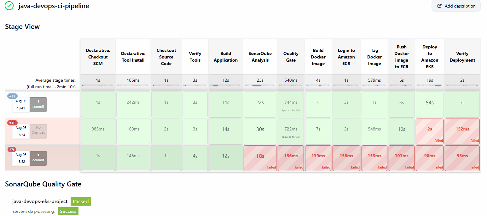
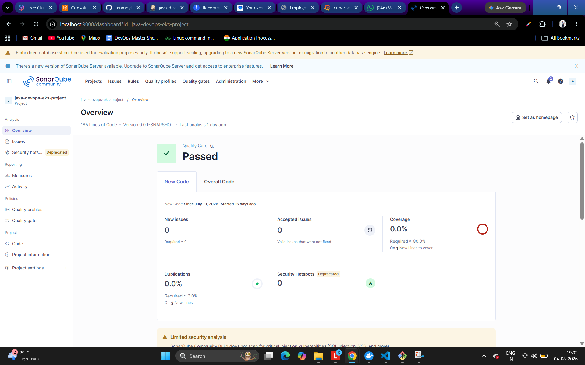
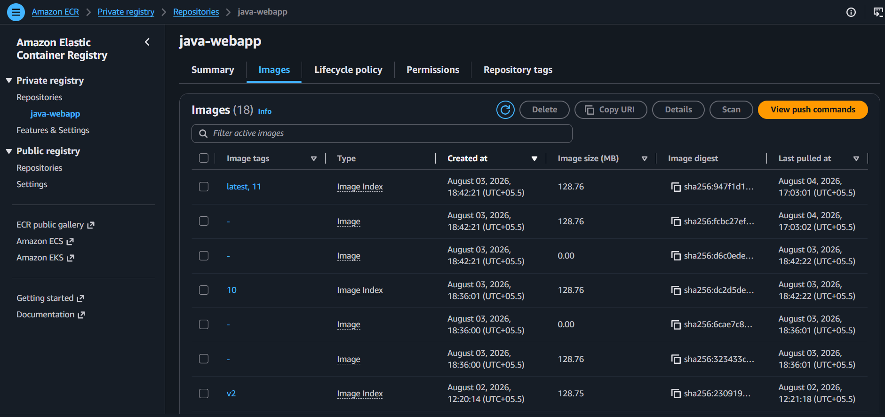
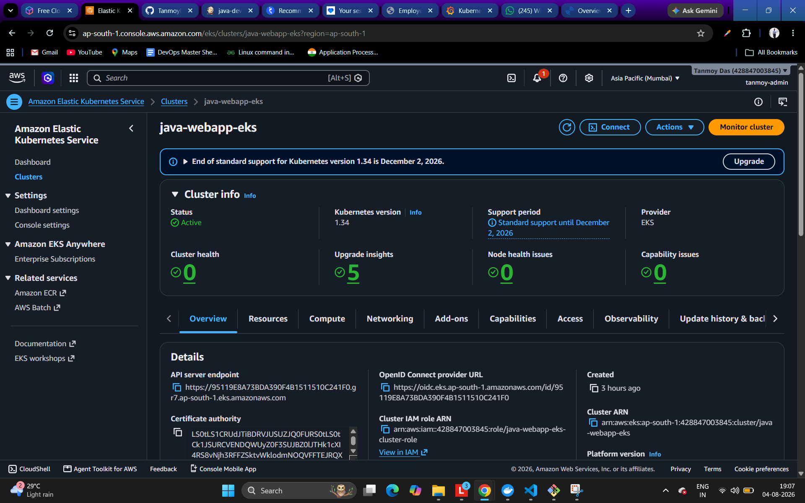
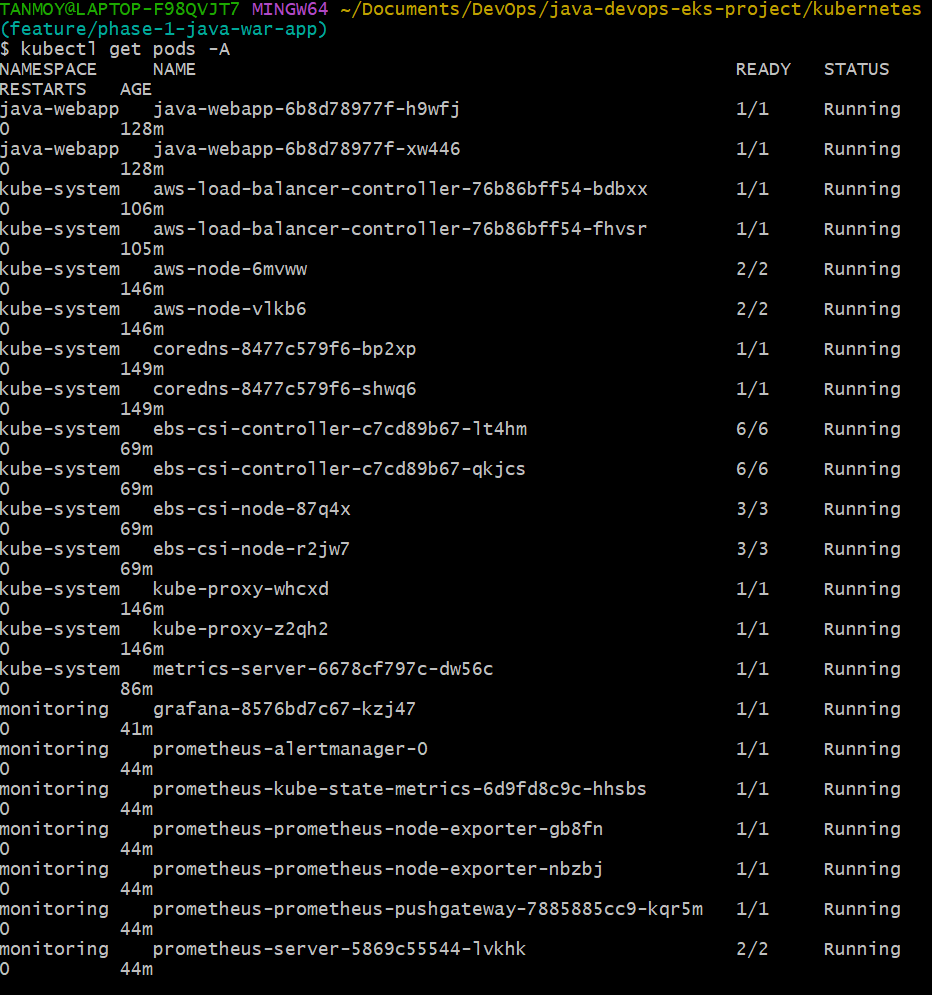
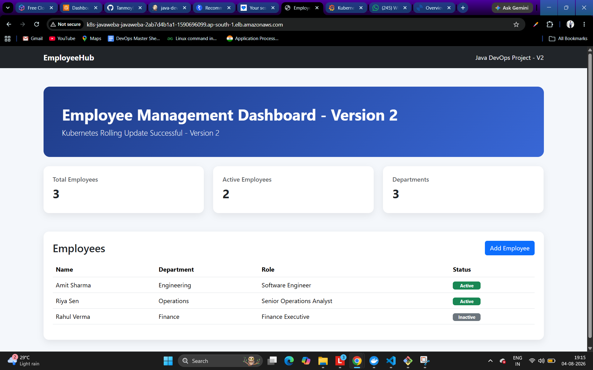
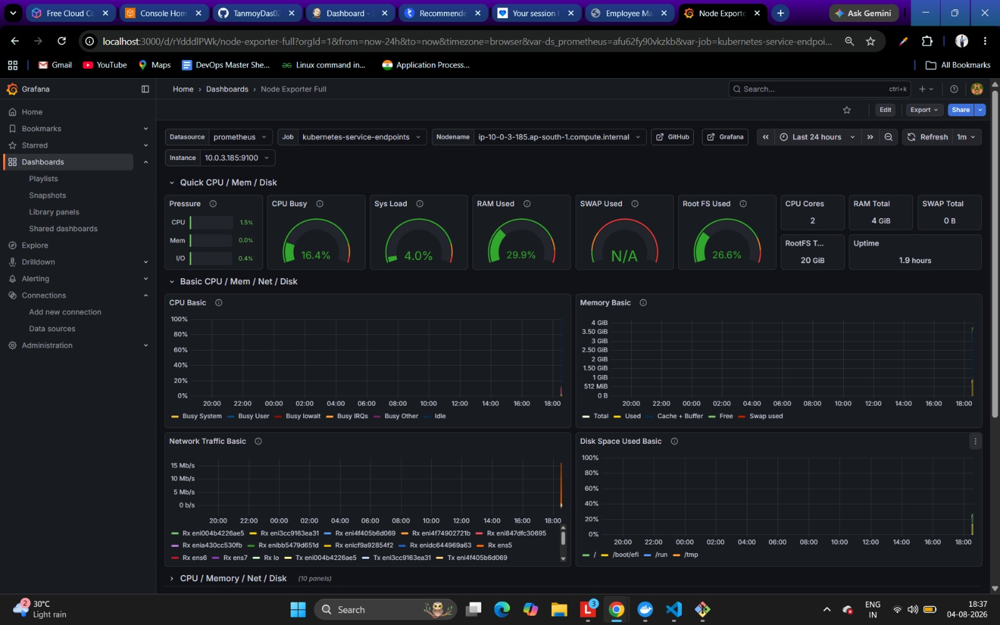
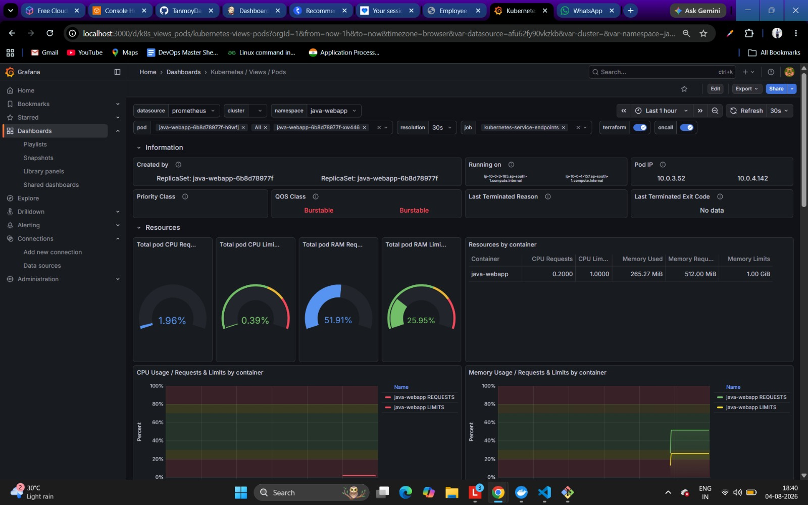
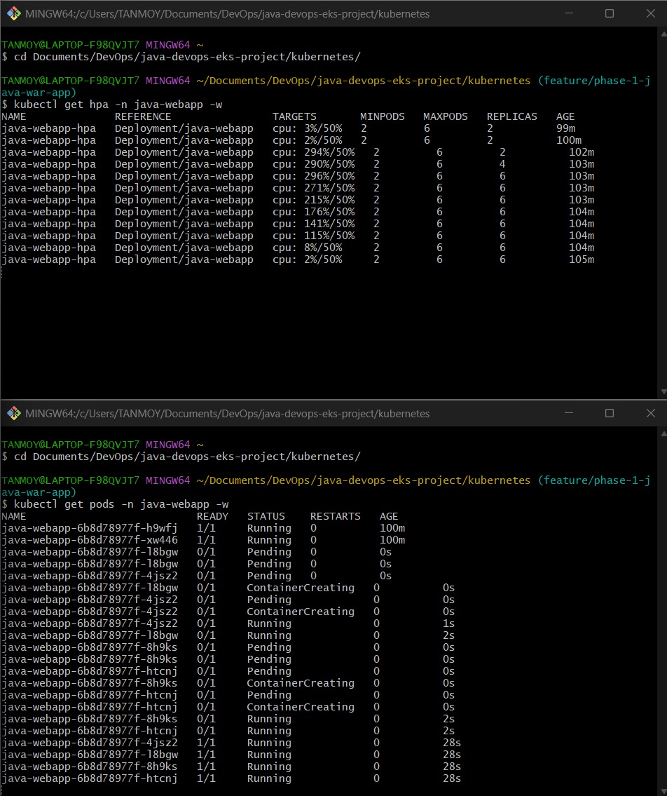

# 🚀 End-to-End Java DevOps Project on AWS EKS

> A production-style end-to-end DevOps project demonstrating Infrastructure as Code (Terraform), CI/CD (Jenkins), Code Quality (SonarQube), Containerization (Docker), Kubernetes (Amazon EKS), Monitoring (Prometheus & Grafana), and Auto Scaling (HPA).


---

# 📖 Project Overview

This project demonstrates a complete DevOps lifecycle by automating the deployment of a Java web application on Amazon EKS.

The infrastructure is provisioned using Terraform. A Jenkins pipeline automates the application build, SonarQube code analysis, Docker image creation, image push to Amazon ECR, and deployment to Kubernetes. The application is exposed using AWS Application Load Balancer (ALB) Ingress. Metrics are collected using Prometheus and visualized through Grafana dashboards. Horizontal Pod Autoscaler (HPA) automatically scales the application based on CPU utilization.

This project follows a production-inspired workflow and includes real-world troubleshooting encountered during implementation.

---

# 🏗 Architecture

```
Developer
      │
      ▼
GitHub Repository
      │
      ▼
Jenkins Pipeline
      │
 ┌────┼─────────────────────────────┐
 │    │                             │
 ▼    ▼                             ▼
Maven Build                 SonarQube Analysis
 │                                   │
 └──────────────┬────────────────────┘
                ▼
          Docker Image Build
                │
                ▼
           Amazon ECR
                │
                ▼
           Amazon EKS
                │
       ┌────────┴─────────┐
       ▼                  ▼
 Deployment            Service
       │                  │
       └────────┬─────────┘
                ▼
        AWS ALB Ingress
                │
                ▼
        EmployeeHub Application

---------------- Monitoring ----------------

Metrics Server
      │
      ▼
Horizontal Pod Autoscaler

Prometheus
      │
      ▼
Grafana
```

---

# 🛠 Tech Stack

## Cloud

- AWS VPC
- Amazon EKS
- Amazon ECR
- IAM
- Application Load Balancer
- EC2 Managed Node Groups

## Infrastructure

- Terraform

## CI/CD

- Jenkins
- GitHub
- Maven
- SonarQube

## Containers

- Docker

## Kubernetes

- Deployment
- Service
- ConfigMap
- Secret
- Ingress
- HPA
- Metrics Server

## Monitoring

- Prometheus
- Grafana
- Node Exporter

---

# 📁 Repository Structure

```
java-devops-eks-project/

├── application/
│
├── terraform/
│
├── kubernetes/
│
├── jenkins/
│
├── monitoring/
│
├── scripts/
│
├── screenshots/
│
├── architecture/
│
├── README.md
│
└── .gitignore
```

---

# ⚙ Infrastructure Provisioning

Infrastructure is fully provisioned using Terraform.

Resources created:

- VPC
- Public Subnets
- Private Subnets
- Internet Gateway
- NAT Gateway
- Route Tables
- IAM Roles
- Amazon EKS Cluster
- Managed Node Group
- Amazon ECR Repository

Terraform Commands

```bash
terraform init

terraform plan

terraform apply
```

Destroy Infrastructure

```bash
terraform destroy
```

---

# 🐳 Docker

The Java application is containerized using Docker.

Build Image

```bash
docker build -t java-webapp .
```

Run Locally

```bash
docker run -p 8080:8080 java-webapp
```

Push to Amazon ECR

```bash
docker push <ECR_URI>:latest
```

---

# 🚀 Jenkins CI/CD Pipeline

The Jenkins pipeline performs the following stages automatically:

- Checkout Source Code
- Verify Required Tools
- Build Java Application
- SonarQube Analysis
- Quality Gate Verification
- Docker Image Build
- Login to Amazon ECR
- Tag Docker Image
- Push Image to Amazon ECR
- Deploy to Amazon EKS
- Verify Deployment

---

# ☸ Kubernetes Deployment

Resources deployed:

- Namespace
- Deployment
- Service
- ConfigMap
- Secret
- ALB Ingress
- Horizontal Pod Autoscaler

Deploy Application

```bash
kubectl apply -f namespace.yaml

kubectl apply -f configmap.yaml

kubectl apply -f secret.yaml

kubectl apply -f deployment.yaml

kubectl apply -f service.yaml

kubectl apply -f ingress.yaml

kubectl apply -f hpa.yaml
```

Verify Deployment

```bash
kubectl get all -n java-webapp
```

---

# 📈 Monitoring

Monitoring stack includes:

- Metrics Server
- Prometheus
- Grafana
- Node Exporter

Installed using Helm.

Grafana dashboards include:

- Node Exporter Dashboard
- Kubernetes Cluster Dashboard
- Kubernetes Pod Dashboard
- Resource Utilization Dashboard

---

# 📊 Horizontal Pod Autoscaler

Configured HPA

Minimum Pods

```
2
```

Maximum Pods

```
6
```

Target CPU

```
50%
```

Verify

```bash
kubectl get hpa -n java-webapp
```

Generate Load

```bash
kubectl exec -it deployment/java-webapp -n java-webapp -- sh

while true; do
wget -q -O- http://java-webapp-service > /dev/null
done
```

Observed Result

```
Pods

2

↓

4

↓

6
```

CPU Utilization exceeded 290% and Kubernetes automatically scaled the application.

---

# 📸 Screenshots

## Jenkins Pipeline



## SonarQube



## Amazon ECR



## EKS Cluster



## Kubernetes Pods



## ALB Application



## Grafana Dashboard




## HPA Scaling



---

# 🔍 Challenges Faced & Solutions

## AWS Load Balancer Controller

Issue:

- ALB Ingress did not receive an external address.

Resolution:

- Associated the correct IAM OIDC provider.
- Created the required IAM Service Account.
- Installed the AWS Load Balancer Controller using Helm.

---

## Metrics Server

Issue:

- HPA displayed CPU metrics as `<unknown>`.

Resolution:

- Installed Metrics Server using Helm.
- Enabled insecure kubelet TLS.
- Verified metrics using `kubectl top`.

---

## Prometheus PVC Pending

Issue:

- Prometheus PersistentVolumeClaims remained Pending.

Resolution:

- Installed the AWS EBS CSI Driver.
- Created a gp3 StorageClass.
- Set gp3 as the default StorageClass.
- Reinstalled Prometheus successfully.

---

## EBS CSI Driver Conflict

Issue:

- Add-on installation failed due to ServiceAccount conflicts.

Resolution:

- Recreated the IAM ServiceAccount.
- Installed the EBS CSI Driver add-on successfully.

---

# 🚀 Future Improvements

- ArgoCD GitOps Deployment
- Helm Charts
- Terraform Remote Backend
- Multi-Environment Deployment
- Blue-Green Deployment
- Canary Deployment
- AWS WAF
- External Secrets
- Slack Notifications
- GitHub Actions Integration

---

# 🎯 Skills Demonstrated

- Infrastructure as Code
- Cloud Infrastructure
- CI/CD
- Docker
- Kubernetes
- Monitoring
- Autoscaling
- Production Troubleshooting
- AWS Networking
- DevOps Best Practices

---

# 👨‍💻 Author

**Tanmoy Das**

DevOps | Cloud | AWS | Kubernetes | Terraform | Docker | Jenkins

LinkedIn:
(Add your LinkedIn URL)

GitHub:
(Add your GitHub Profile URL)

---

# ⭐ If you found this project useful, consider giving it a Star.